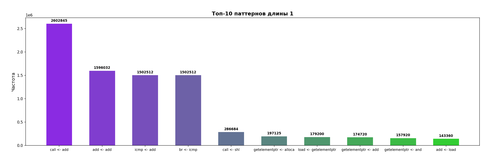
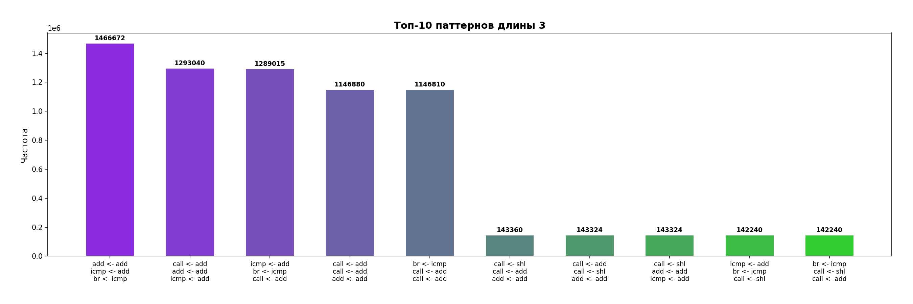
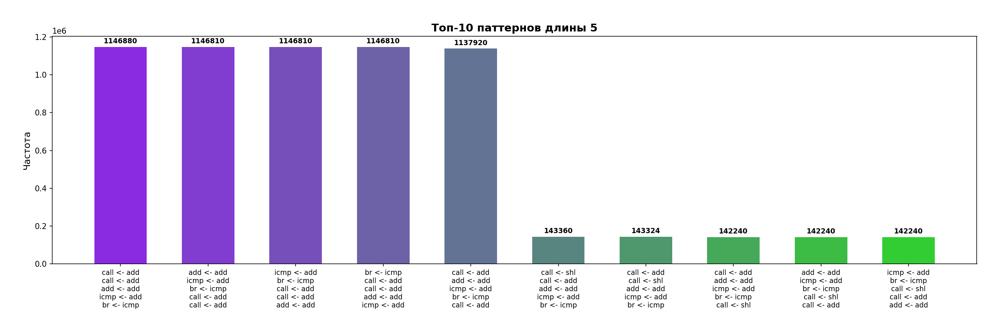

# LLVM Pass

## Описание

Это пример реализации LLVM пасса, который в runtime'е собирает трассу исполненных IR инструкций (`User <- Operand`) графического приложения (только для логического модуля `../01_SDL/src/app.c`) на `-O2`.

Если `User` это `phi`, то `User` не логируется. Если же `phi` является операндом в какой либо инструкции, то логируются интрукции, используемые в операндах этого `phi`.

**Пример**: запись `shl <- phi` заменяется на две записи `shl <- add` и `shl <- sub`, если этот `phi` использует в качестве операндов `add` и `sub`.

Провести анализ часто повторяемых паттернов (длина паттерна: 1-5 инструкций). Собранную статистику выложить в репозиторий.

## Компиляция и запуск
1. Компиляция пасса:
```powershell
clang++ pass_trace.cpp -fPIC -shared -I$(llvm-config --includedir) -o libPass.so
```

2. Генерация LLVM IR из исходного C-кода:
```powershell
clang -O2 ../01_SDL/src/app.c -emit-llvm -S -o app.ll
```

3. Применение пасса к полученному IR:
```powershell
clang -O2 -fpass-plugin=./libPass.so app.ll -emit-llvm -S -o app.after_pass.ll
```

4. Компиляция и линковка финальной программы
```powershell
clang -O2 log.c app.after_pass.ll ../01_SDL/src/start.c ../01_SDL/src/sim.c -lSDL2 -o get_log.out
```
<br> 

Можно запустить скрипт `run.sh` для выполнения всех этих команд вместе:
```powershell
bash ./run.sh ../01_SDL/src/app.c ../01_SDL/src/start.c ../01_SDL/src/sim.c -lSDL2
```

На выходе получим файл `get_log.out`.


## Анализ результатов
Проведём анализ часто повторяемых паттернов (длину паттерна будем варьировать от 1 до 5 инструкций). 

Для этого получим `trace.log`:
```powershell
./get_log.out > trace.log
```

Стоить учесть, что приложение начинает подлагивать (а через некоторое время и вовсе зависнет) в силу того, что такое количество логирования требует значительных ресурсов ЦП. Не стоит ждать много времени работы приложения `get_log.out`, так как итоговый файл будем слишком большого объёма, что анализ никак не улучшит. В связи с этим, можно запустить `run.sh` с опциональным параметром `time=seconds`, где `seconds` - время в секундах работы программы (положительное целое число):
```powershell
bash ./run.sh ../01_SDL/src/app.c ../01_SDL/src/start.c ../01_SDL/src/sim.c -lSDL2 time=seconds
```

Теперь с помощью `analyze.py` получим статистику в виде графиков часто повторяемых паттернов:
```powershell
python3 analyze.py
```

Итак, было получено:
<br>






